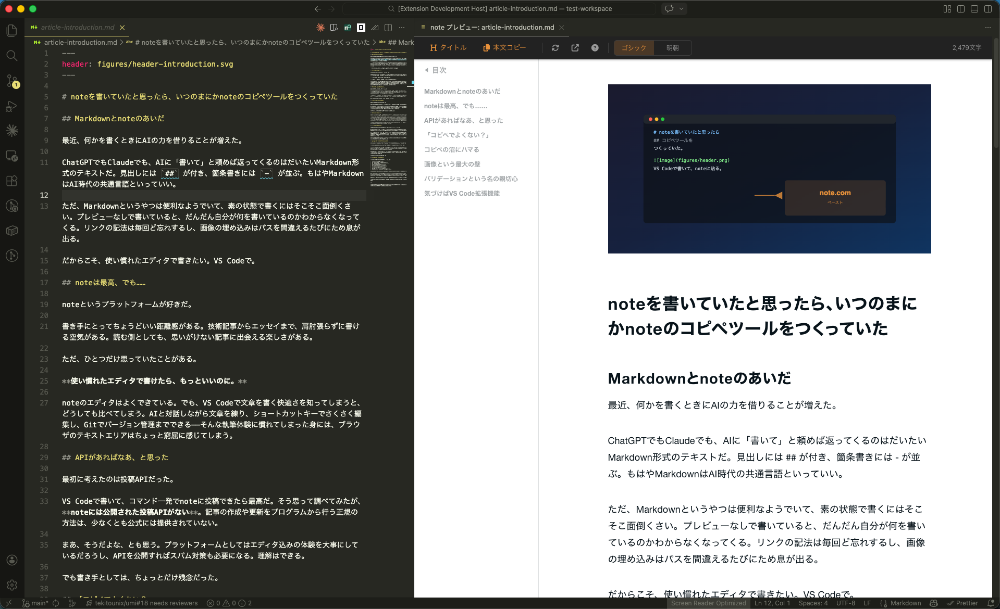

# note-md

非公式の note 向け Markdown プレビュー・画像処理・本文コピーを提供する VS Code 拡張機能。

> **本プロジェクトは note 株式会社および note.com とは無関係の個人プロジェクトです。**
>
> **現在ベータ版（v0.x）です。** 仕様や API が変更される場合があります。

## 機能

### プレビュー

- note の表示に近いスタイルでリアルタイムプレビュー
- アクティブな Markdown エディタに自動追従
- ゴシック / 明朝の書体切り替え
- 目次（サイドバー TOC）と文字数カウンター（実サイトとは計算方法が異なる場合があります）
- 数式（KaTeX）、Mermaid ダイアグラム、シンタックスハイライト対応

### 本文コピー

- note のエディタに直接ペーストできる HTML をクリップボードにコピー
- h1 を自動除去し、タイトルは別ボタンでコピー
- 数式を note の `$${...}$$` 記法に自動変換
- Mermaid を note 認識のフェンス記法に変換
- ルビ（`｜漢字《かんじ》`）を保持
- 連続画像の消失を防ぐスペーサーを自動挿入

### 画像処理

- note 非対応フォーマット（SVG, WebP, BMP, TIFF）を PNG に自動変換
- Retina 2x（1240px 幅）で出力
- 外部一時ホスティングへ自動アップロード（初回に同意確認あり）
- SHA-256 ハッシュで同一画像の重複アップロードをスキップ

### バリデーション

- note 非対応書式（テーブル、インラインコード、イタリックなど）を警告
- VS Code の Problems パネルに表示
- 画像パスの安全性チェック（パストラバーサル検出）
- QuickFix 対応（h1 分割、画像 title 除去など）
- `<!-- note-ignore-next-line -->` で個別の警告を抑制可能

## インストール

VS Code Marketplace で **「note-md」** を検索してインストール。

> **Marketplace 未公開の場合**: [Releases](https://github.com/tekitounix/note-md/releases) から `.vsix` をダウンロードし、拡張機能ビュー → `…` → **VSIX からインストール…**、またはコマンドラインで `code --install-extension note-md-*.vsix`

## クイックスタート

1. 拡張機能をインストール
2. Markdown ファイルを開く
3. エディタ右上のプレビューアイコン、またはコマンドパレットから **「note プレビューを開く」** を実行
4. ツールバーの **「タイトル」** → note のタイトル欄にペースト
5. ツールバーの **「本文コピー」** → note のエディタ本文にペースト

ローカル画像がある場合は、プレビューを開くと自動で変換・アップロードされます（初回に確認ダイアログが表示されます）。

## 対応書式

### 使える書式

| 書式 | 備考 |
|------|------|
| 見出し（h2, h3） | |
| 太字 | |
| 取り消し線 | |
| リンク | |
| 箇条書き / 番号付きリスト | 入れ子対応 |
| 引用 | |
| コードブロック | シンタックスハイライト対応 |
| 区切り線 | |
| 画像 | |
| ルビ | `｜漢字《かんじ》` 記法 |
| インライン数式 / ディスプレイ数式 | KaTeX、中央寄せ対応 |
| Mermaid ダイアグラム | |
| テキスト配置 | 中央寄せ / 右寄せ |

### 使えない書式（note の制約）

| 書式 | 理由 |
|------|------|
| テーブル | note がペースト時に無視する |
| インラインコード | note が非対応。本文コピー時にバッククォートを除去 |
| イタリック | `<em>` / `<i>` 全て note が無視する |
| 画像キャプション | ペースト経由で設定不可（60 パターン以上で検証済み） |
| 連続画像 | 画像が連続すると最後以外が消失するため、間に空行を自動挿入（note 側の制約） |

詳細は [docs/format-reference.md](docs/format-reference.md) を参照してください。

## 設定

| 設定 | 説明 | デフォルト |
|------|------|------------|
| `note-md.uploadExpiry` | 画像アップロードの有効期限 | `72h` |
| `note-md.enabledUploadServices` | 利用するアップロードサービス名の一覧 | `['litterbox.catbox.moe', 'imgbb.com']` |
| `note-md.validator.disabledRules` | 無効化するバリデーションルール ID | `[]` |

## データの取り扱い

> **重要**: この拡張機能は画像のアップロード時に外部サービスを利用します。
> 初回のアップロード実行時に確認ダイアログが表示されます。

### アップロードされるデータ

- Markdown 記事中に参照されている**ローカル画像ファイル**のみがアップロード対象です
- 記事本文、メタデータ、その他ファイルは一切送信されません

### 送信先サービス

note のエディタはペースト時にブラウザ上で画像 URL を fetch するため、配信ドメインが `access-control-allow-origin: *` を返す（CORS 対応の）サービスのみ使用できます。

| 優先度 | サービス | 運営 | 保持期間 | CORS | 備考 |
|--------|----------|------|----------|------|------|
| 1 | [litterbox.catbox.moe](https://litterbox.catbox.moe/) | Catbox LLC (米国) | 1h–72h (設定可能) | `*` | 一時ホスティング専用。Catbox 利用規約に商用利用の事前承認条項あり |
| 2 | [imgbb.com](https://imgbb.com/) (i.ibb.co) | ImgBB | 有効期限指定可 | `*` | 非公式エンドポイント (`/json`) を使用（後述） |

既定では両サービスが有効です（litterbox 優先、imgbb はフォールバック）。

> **imgbb.com について**: API キー不要の `/json` エンドポイントを使用しています。
> これは imgbb.com の公式 API (`api.imgbb.com`) ではなく、Web フロントエンドが内部的に使用しているエンドポイントです。
> 予告なく廃止・仕様変更される可能性があるため、フォールバック用途としてのみ利用しています。

### アクセス可能性

- アップロードすると公開 URL が発行され、URL を知っている人は保存期間中その画像にアクセスできます
- パスワード保護や認証はありません
- 機密画像や限定公開前提の画像はアップロードしないでください
- サービス提供者側で IP アドレス、ファイル名、ハッシュ、アップロード時刻等が記録される場合があります

### 目的と仕組み

- note の記事エディタに本文コピーをペーストすると、note がブラウザ経由で画像を取得し自社 CDN にコピーします（このため CORS 対応が必須）
- 一時的なホスティングで十分であり、画像 URL は長期間有効である必要はありません
- アップロード結果は VS Code のセッション内メモリにのみキャッシュされます
- **ディスクへの永続化は行いません** — VS Code の再起動でキャッシュはクリアされます
- 同一セッション内で同じ画像を再処理する場合は、SHA-256 ハッシュで重複を検知しスキップします

### 各サービスの利用規約

利用にあたっては、各サービスの利用規約もご確認ください:

- Catbox LLC (litterbox): [利用規約](https://catbox.moe/legal.php)
- ImgBB: [利用規約](https://imgbb.com/tos)

### 法務上の注意

- この拡張機能は法的助言を提供しません
- 第三者サービスの利用規約、保存期間、ログ方針、商用利用可否は利用者自身で確認してください
- 組織利用や有償提供に組み込む場合は、利用するアップロード先を明示的に選定してください

## 開発

- ビルド: `npm run compile`
- 回帰テスト: `npm test`
- パッケージ: `npm run package`

## ドキュメント

- [docs/format-reference.md](docs/format-reference.md): 対応書式と制約
- [docs/paste-workflow.md](docs/paste-workflow.md): note へ貼り付ける実運用手順
- [docs/image-specs.md](docs/image-specs.md): note の画像仕様メモ
- [THIRD_PARTY_NOTICES.md](THIRD_PARTY_NOTICES.md): 外部依存と第三者サービスの注意事項
- [docs/architecture.md](docs/architecture.md): 実装アーキテクチャ
- [docs/validator.md](docs/validator.md): バリデータの設計と運用
- [docs/release-checklist.md](docs/release-checklist.md): リリース前の確認項目

## ライセンス

MIT
