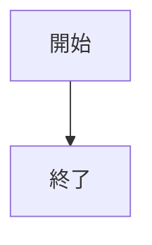

# note 投稿 書式リファレンス

note.com に Markdown 記事を投稿する際に、この拡張機能で安全に扱える書式の一覧です。
ここでいう「本文コピー」は、拡張機能の「本文コピー」ボタンで生成する貼り付け用 HTML を指します。

## 使える書式

### 見出し

```markdown
## 大見出し（h2）
### 小見出し（h3）
```

note では h2 と h3 のみ対応です。
h1 (`# タイトル`) は記事タイトルとして使い、本文コピー時には自動的に除去されます（note のタイトル欄に別途入力）。

### 太字

```markdown
**太字のテキスト**
```

### 取り消し線

```markdown
~~取り消し線のテキスト~~
```

### リンク

```markdown
[リンクテキスト](https://example.com)
```

太字リンクも可能です。

```markdown
**[太字リンク](https://example.com)**
```

### 箇条書きリスト

```markdown
- 項目 A
- 項目 B
- 項目 C
```

### 番号付きリスト

```markdown
1. 手順 1
2. 手順 2
3. 手順 3
```

### 入れ子リスト

インデントでリストをネストできます。3 階層まで動作確認済みです。

```markdown
- 項目 A
  - サブ項目 A-1
  - サブ項目 A-2
    - サブサブ項目
- 項目 B
```

番号付きと箇条書きの混合もできます。

```markdown
1. 手順 1
   1. 手順 1-a
   2. 手順 1-b
2. 手順 2
   - 補足事項
```

### 引用

```markdown
> 引用テキストです。
```

### コードブロック

````markdown
```c
int x = 42;
```
````

言語を指定するとプレビューでシンタックスハイライトが適用されます。

### 区切り線

```markdown
---
```

### 画像

```markdown

```

- SVG / WebP / BMP / TIFF は画像処理時に PNG に自動変換されます
- 本文コピー時にはアップロード済み URL に自動で差し替えられます
- note は表示幅 620px に縮小しますが、拡大時は原寸（最大 4000px）で表示されます
- ツール側は Retina 2x（1240px 幅）で PNG を生成します

### ルビ（ふりがな）

```markdown
｜漢字《かんじ》にルビをふるテスト
```

note 独自の記法です。半角 `|` でも全角 `｜` でも動作します。
プレビューでは `<ruby>` HTML としてレンダリングされます。

### インライン数式

```markdown
アインシュタインの式 $${E = mc^2}$$ です。
```

`$${` と `}$$` で囲みます。note 独自の記法です。

### ディスプレイ数式（別行立て）

```markdown
$$
\int_{0}^{\infty} e^{-x^2} dx = \frac{\sqrt{\pi}}{2}
$$
```

本文コピー時には自動的に `$${ ... }$$` 形式に変換されます。
プレビューでは KaTeX でレンダリングされます。

### 数式の中央寄せ

`<p style="text-align:center">` 内にインライン数式を書くと、note でも中央寄せで表示されます。

```markdown
<p style="text-align:center">$${\int_{0}^{\infty} e^{-x^2} dx = \frac{\sqrt{\pi}}{2}}$$</p>
```

### Mermaid ダイアグラム

````markdown

````

プレビューでは Mermaid でレンダリングされます。
本文コピー時には note が認識するフェンス記法（```` ```mermaid ````）のテキストに変換されます。

### テキスト配置（中央寄せ・右寄せ）

Raw HTML として記述します。

```html
<p style="text-align:center">中央寄せのテキスト</p>
<p style="text-align:right">右寄せのテキスト</p>
```

### 引用の出典（Raw HTML）

Markdown の引用ブロックに出典を付けたい場合は、Raw HTML で記述します。

```html
<blockquote>
<p>引用テキスト</p>
<footer><cite>出典名</cite></footer>
</blockquote>
```

出典にリンクを付けることもできます。

```html
<blockquote>
<p>引用テキスト</p>
<footer><cite><a href="https://example.com">出典名</a></cite></footer>
</blockquote>
```

## 使えない書式

以下の書式は note のペースト機能が対応していないため、使用できません。

| 書式 | 理由 |
|------|------|
| テーブル | Markdown 記法・HTML ともに note がペースト時に無視する |
| インラインコード (`` `code` ``) | note のエディタが現時点で非対応。本文コピーではバッククォートを除去し素のテキストにする |
| イタリック (`*text*`) | `<em>` / `<i>` / `font-style: italic` すべて note が無視する |
| 画像キャプション | note がペースト時に figcaption を無視する（60 パターン以上で検証済み） |
| `<details>` / `<summary>` | HTML5 要素。Markdown 仕様外。note が非対応 |
| 定義リスト (`<dl>`) | Markdown 仕様外（PHP Markdown Extra 拡張）。note が非対応 |

### インラインコードについて

Markdown のインラインコード（`` `counter` ``）は note では非対応のため、本文コピー時に自動的にバッククォートを除去し、素のテキストとして出力します。

### 画像キャプションについて

note のエディタには画像キャプション機能がありますが、ペースト（HTML 貼り付け）経由ではキャプションを設定できません。以下のすべてのアプローチを検証しましたが、いずれも失敗しました。

- `<figure>` + `<figcaption>` の標準的な構造
- note 内部の HTML 構造（UUID 属性付き figure）
- note の実画像 URL を使用した figure
- 画像直後の装飾テキスト（中央寄せ、グレー、small、em 等）
- 画像と同一段落内のテキスト
- blockquote / cite / footer / mark / del / u 等のタグ
- data 属性・title 属性・aria-label 属性
- table caption タグ
- その他創造的アプローチ（上キャプション、リスト、見出し等）

キャプションが必要な場合は、note のエディタ上で画像を選択し、手動で設定してください。

### 連続画像の空行について

Markdown で画像が連続する場合（間にテキストがない）、note へのペースト時に画像間に空行が 1 行挿入されます。

```markdown


```

これは note の制約です。note のエディタは、ペーストされた HTML 内の画像を外部 URL からフェッチし自身の CDN に再アップロードしますが、隣接する画像段落（`<p></p><p></p>`）をそのまま処理すると最後の画像以外が消失します。

この問題を回避するため、本文コピー時に連続画像の間に空段落（`<p>&nbsp;</p>`）を自動挿入しています。この空段落が note 上で空行 1 行として表示されます。

以下のセパレータを検証しましたが、画像が表示されないか同等以上の余白が発生しました：

- ゼロ幅スペース、`<br>`、`<span>`、`<div>`、空 `<p>`、`<wbr>` → 画像が消失
- `<p>` + スタイル指定（`font-size:0` 等） → note がスタイルを除去するため効果なし
- `<figure>` + `<figcaption>`（note 内部 DOM 構造の完全再現を含む） → 画像が消失
- `<hr>` → 機能するが区切り線が表示され見た目が悪い

空行が気になる場合は、ペースト後に note のエディタ上で手動削除してください。
