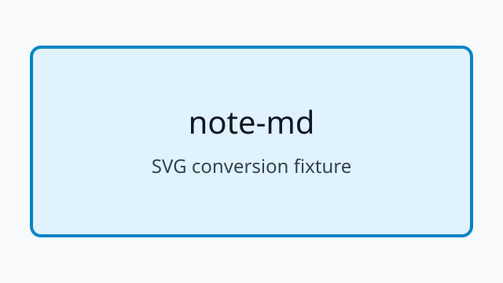
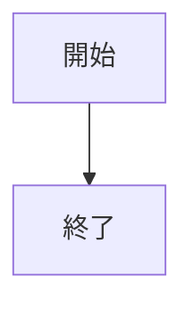

# note-md デバッグ用サンプル

## 基本書式

本文、**太字**、リンク、ルビ（｜漢字《かんじ》）、数式 $${E = mc^2}$$ を確認する。

### QuickFix 対象

#### h4 は h3 へ変換できる

ここには `inline code` と *italic* を含める。

空行は 2 行までに整理できる。

### 画像

### Raw HTML

中央寄せテキスト

